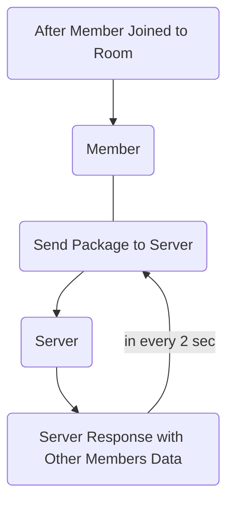
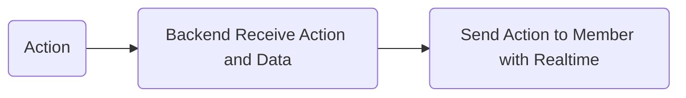
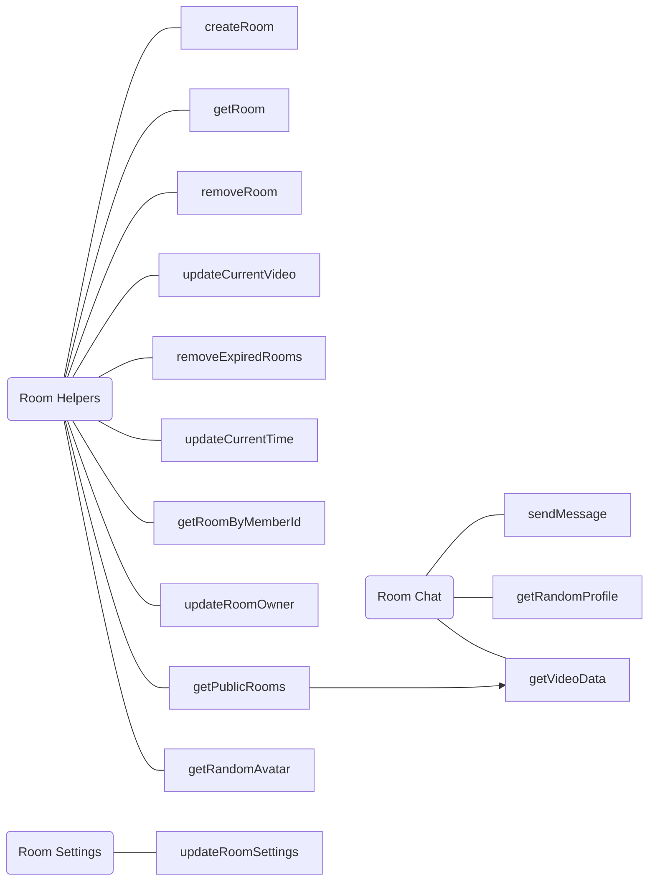
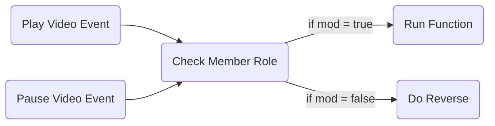
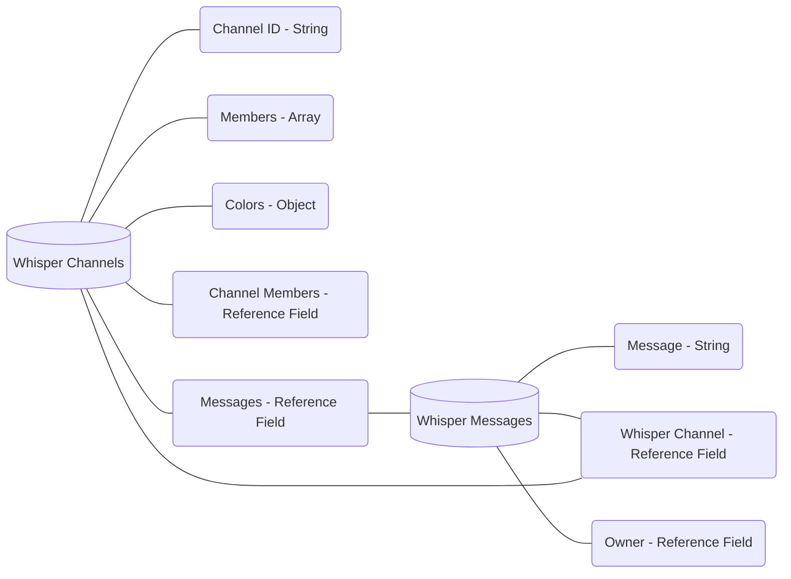
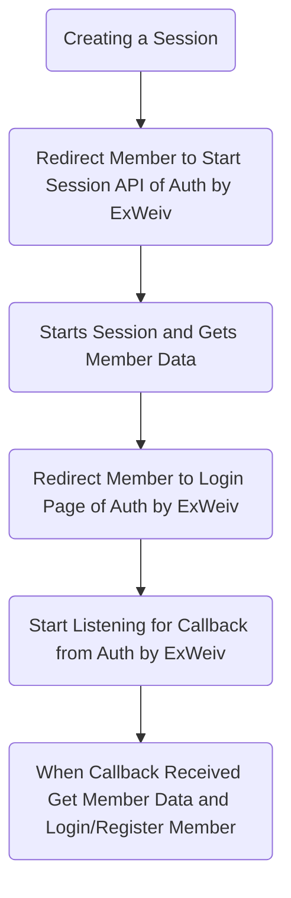

<h1  border-bottom="none">Watch by ExWeiv</h1>

Welcome to Watch by ExWeiv docs. As you read you will understand how Watch by ExWeiv works and architecture behind of Watch by ExWeiv. Services, APIs and any feature we use inside Wix or outside of Wix. So let's look at Watch by ExWeiv's architecture.

## APIs We Use
We are using 13 Wix/Velo API in backend and frontend of Watch by ExWeiv (11 Unique API):
- **Backend**
	- Wix Data
	- Wix Members Backend
	- Wix Site Backend
	- Wix Realtime Backend
	- Wix Fetch
	- Wix HTTP Functions
	- Wix Router
- **Frontend**
	- Wix Window
	- Wix Location
	- Wix Members
	- Wix Storage
	- Wix Realtime

#### Outside of Velo APIs we are using two external API
- Randoms by ExWeiv APIs
- Auth by ExWeiv APIs

> We are using Randoms by ExWeiv APIs to get random avatar and profile data for guest users.

> We are using Auth by ExWeiv APIs to integrate our oAuth server to Watch by ExWeiv so everyone can login from one place to every ExWeiv service. 

## How Does it Works?

We don't even know. Just kidding. No I wasn't.

Anyway, main point of Watch by ExWeiv is doing something in realtime so almost everything is built with Realtime APIs. We have seperated features into services (SOA) so let us show you services:

- Live Server Service
- Members Service
- Room Service
- Watching Service
- Whisper Service

Every service has their own feautures and sometimes they do communicate with each-other. To understand everything better first we need to take a look at services and their architecture.


## Live Server Service

Let's start with **Live Server Service** this service is creating a server and updating it for members inside of a room. It works like an online game. When a member joins into a room member sends a package to server, server takes this package and respond to member with packages received from other members.

In this way we sync members and their data.



So we keep every member data in the room in this way. Because we have backend limitations (7000 Request/min). We have 2 sec delay before next update.

#### But How Does Server Understand If Somone Disconnected?

There is no funciton we can call after member left the page. Because member is not there anymore. But we have the data of member in our **Server Collection** every time members sends their packages server updates a filed in their data (in collection) **lastOnline** as we have at least a single member in the room in every update server will check lastOnline dates with current time and will remove anyone not updated their data for more than 10 second.

*Code form backend:*
```js
connectedMembers = connectedMembers.filter((member) => {
	const now = moment();
	const lastOnlineDate = moment(member.lastOnline);
	const diffSeconds = moment.duration(now.diff(lastOnlineDate)).asSeconds();
	return diffSeconds < 10 === true;
});
```

Internal Service/s Used in This Service:
- Room Service

## Members Service
Next is Members Service. We are using Members Service to realtime actions between members. In every room there are two roles, **Viewers** and **Moderators (Mods)** mods can ban viewers or change their role as mod.

In this service we have two tiny sweet function.
- banMember
- changeRole



Both of these backend functions works with Realtime APIs and they do not save data to any collection because we don't need to save data about room bans or role changes. Members will use these rooms to watch video at the moment they will not gonna use the same room most of the time. So saving these data don't make any sense. (In fact we are too lazy)

## Room Service

Room Service is here for handling main room based functions. We have three group inside this service:

- Room Chat
- Room Helpers
- Room Settings

Every group has their own functions but in the end belongs to Room Service.

### Room Chat
Room Chat is handling chat functions for the room. Sending messages to chat, creating random profile data for member and getting video data from the url.

**Funciton List:**
- sendMessage
- getRandomProfile
- getVideoData

### Room Helpers
Room Helpers is actually the main functions of rooms. Creating a room, getting room data and similar functions runs here. 

**Funciton List:**
- createRoom
- getRoom
- removeRoom
- updateCurrentVideo
- removeExpiredRooms
- updateCurrentTime
- getRoomByMemberId
- updateRoomOwner
- getPublicRooms
- getRandomAvatar

### Room Settings
Room Settings handles the updating room settings. Like language, status etc. And has only one function:

- updateRoomSettings

#### Communication Between These Three Group


## Watching Service
Watching Service handles video player realtime events with Realtime API and have three functions:

- playVideo
- pauseVideo
- changeVideo

In watching service we have blocker that works in frontend. In every room as we said we have two role; mods and viewers. Only mods can use Watch Service functions.

Viewers can not pause, play or change the video. They can paste YouTube video URL to the chat and mods can play video from chat with one click. But viewers can't use these functions.

When they try to pause or play video code will do the reverse. When mods pauses or plays the video every member will get the same action on with **currentTime** data.

> Sometimes there will be 0-2 sec delay so Watch by ExWeiv is not fast enough for someone wants 0 delay. For general videos delay in Watch by ExWeiv is fast enough but for others it may not be fast as user wants. (We are open for pull requests for this)

Blocker System in Frotned (Logic)


Internal Service/s Used in This Service:
- Room Service

## Whisper Service
Next to the general chat we have Whisper in Watch by ExWeiv so members can text to each-other. General chat has no history because we do not save any data for general chat but for Whisper we are saving data so Realtime and Data APIs works together.

**DB System of Whisper**


**We have four functions in this service:**
- sendWhisperMessage
- getWhisper
- createWhisperChannel
- getChannelMessages

> From their names you can understand what they do.


## Watch by ExWeiv Service Oriented Architecture

```mermaid
flowchart TB

subgraph npm [NPM]
    moment((Moment NPM Pack))
    uuid((uuid NPM Pack))
    youtube((YouTube-sr NPM Pack))
    randomstring((randomstring NPM Pack))
    randomcolor((randomcolor NPM Pack))
    end

subgraph wix [Wix APIs]
    realtime((Wix Realtime APIs))
    wixData((Wix Data APIs))
    members((Wix Members APIs))
    fetch((Wix Fetch APIs))
    secrets((Wix Secrets APIs))
    end

subgraph wbservices [Watch by ExWeiv Services]
    liveServerService((Live Server Service))
    membersService((Members Service))
    roomService((Room Service))
    watchingService((Watching Service))
    whisperService((Whisper Service))
    end

style wix fill:#674FE6
style npm fill:#ef400b
style wbservices fill:#bf0033

subgraph liveServerServiceG [Live Server Service]
    liveServerService ==== updateServerMembers --- updateCurrentTime
    updateCurrentTime ---- realtime & wixData & moment & wixData
    end

subgraph membersServiceG [Members Service]
    membersService ==== banMember & changeRole & isMemberExist
    banMember ---- realtime
    changeRole ---- realtime
    isMemberExist ---- members
    end


subgraph roomServiceG [Room Service]
    roomService === roomChat{{Room Chat}} & roomHelpers{{Room Helpers}} & roomSettings{{Room Settings}}
    subgraph roomChatG [Room Chat]
        roomChat ==== sendMessage ---- realtime
        roomChat ==== getRandomProfile ---- fetch
        getRandomProfile ---- uuid

        roomChat ==== getVideoData ---- youtube
        end
    subgraph roomHelpersG [Room Helpers]
        roomHelpers ==== createRoom ---- randomstring & moment & uuid & wixData & members
        roomHelpers ==== getRoom ---- wixData
        roomHelpers ==== removeRoom ---- wixData
        roomHelpers ==== updateCurrentVideo ---- wixData
        roomHelpers ==== removeExpiredRooms ---- wixData
        roomHelpers ==== updateCurrentTime ---- wixData
        roomHelpers ==== getRoomByMemberId ---- wixData
        roomHelpers ==== updateRoomOwner ---- wixData
        roomHelpers ==== getPublicRooms ---- getVideoData & wixData
        roomHelpers ==== getRandomAvatar ---- fetch & secrets
        end
    subgraph roomSettingsG [Room Settings]
        roomSettings ==== updateRoomSettings ---- wixData
        end
    end

subgraph watchingServiceG [Watching Service]
    watchingService ==== playVideo ---- realtime
    watchingService ==== pauseVideo ---- realtime
    watchingService ==== changeVideo ---- realtime & updateCurrentVideo & getRoom
    end

subgraph whisperServiceG [Whisper Service]
    whisperService ==== sendWhisperMessage ---- wixData & realtime
    whisperService ==== getWhisper ---- wixData
    whisperService ==== createWhisperChannel ---- randomcolor & wixData & uuid
    whisperService ==== getChannelMessages ---- wixData
    end
```



[View in browser page.](https://mermaid.live/view#pako:eNqdVttu2zgQ_RWBCwQqEAeuXNmOgX3oJe0WWHeNJGjQxn6gJNomqotBUo69hv-9w5skSsq2WQdwyJkz5Jzh4dAnFBcJQTO0TouneIuZ8O7fLXP9x8tow_Bu6-W7zHv8spivlrkHn6zISC58f67-e-DwFjj-8eqVdpclTXxffndcx6IUZUR8_1tR3sNgwFkHw3CeFBkXjOYb32_OnoHGRVowi1STDpDkiUPoiR68xwf4erv4zA0rRnAqaAbJScetmSmEXQbCPmCBNUKOHG9Gsogwrr1zPXEAayLirXZ_lEPHyUnMiDDRd3riADocIk7YnsaEAxUsl4uO3s3hgdA9xGuPoZbSPZEmwozD9_8Gk6dtFt3iUUEtlRaMFUVWYW5h0gY8yaTg2CrQgzF0gFvKd43cHvS8DbMFEMeUqBNc0zSd_TGevPl4M7Z2KVVtJ-s3w2FU4etqaXe0Hg5HI6einTJ98h576vRcUb0_4eOVuwQL47CVGwwGxv6-ZAzuzD0oy1yWtlmCB5UYvQsrOhjpe1eb-nXhHh9QaJ3fqu-Ude4RzjUY9oBmkG_IbZHKHCjX9psD5ULH11gnYe1sBPd4ndU0wGTjMGpwamgNCDXFtuqIUVJR8_dbLE4nBZbD8xmISPtfJAV1ceMys8p7R4QAjVq3nZ7P5po2U5LL2nzk2CRjE5ImXVgOlOaEc7zpLUg3YEPErepnC1aAXk2UaiB1SD9INl5ZvGcX_koTUihJKbzpyXWAKn-Hq6mTpWumLcbGqreCFgbSVmjNudnKG2pWL4Wj86YYepeWzKt1ndvQC2ckK_bkJRHOtVQFe9leN4cdZSSRW_L_tWfdCn4daKrx7qiv1efkZTvK2H-ecnuTf2u_RRmlNG7Qc3R18ZtJK0G83QOQNQQO4eYx_JUm7eWse4Ket1RpzW3Slb2fd7Vn5-V1H7ZP5v1tvGyr3hdQ779L8bGhKLcT9EfgkpOXhegG3BMj71tX2xdWQ88Qdh5oydd9oVd973jd-QzaaYD1bW-x6VkDcrMbdk-qL0B3HhMDvS_PSdrsQfpHYrPl6Kb5HwmYVQyHPskAUXSJMsIyTBP4RX2S5iUSWwLc0AyGCWY_lmiZnwGHS1HcHfMYzdY45eQS6VP5QDGUPKusO5x_h2NBM8FKmJKEioLN9U929ctdQdDshA5oFo6ugnAynV6Ho-nk9TQYX6IjmgVheDUZBpPhaBoG0yC4Pl-if9WawyuAhePXYRgG18H1cDQ-_wQkKv7f)

## Room Page (Frontend)
For the server side which is where the almost everything done we talked enough. Let's talk about for the client side. What do we do in the frontend of Room Page which is the most important page of Watch by ExWeiv.

**Technologies Working in Frontend:**
- SSR (Server Side Rendering)
- State Manager (Storeon Velo)
- Repeater Scope (Wix Repeater Element)
- HTML Message Renderer (For General Chat)

Let's start with SSR. We are using a small function to call backend functions only when we are on the server side of page loading (This happens when it's possible). In this way we are rendering page faster and we are using less server resource.

> [SSR Warmup Tool](https://shoonia.site/ssr-and-warmup-data/)
> [Wix API](https://www.wix.com/velo/reference/wix-window/rendering/env)

State Managers are life savers. If we would built Room Page without a state manager probably we would write at least 200 more lines. We are using [Storeon Velo](https://www.npmjs.com/package/storeon-velo) created by shoonia. A state manager for Velo/Wix sites.

> [Shoonia's Blog Post About the State Manager](https://shoonia.site/corvid-storeon/)

Repeater Scope is something special to Wix and again created by shoonia. On Wix sites we don't have removeEventListener and most of the time we don't need it but if we are using a repeater and if we are updating the repeater we can have a problem with event listeners. Every time we refresh repeater we will create new event listener (if we write our event listeners inside repeater event handlers like onItemReady) and so on one click will be 5 click. To solve this problem we are using a small function.

> [Repeater Scope in NPM](https://www.npmjs.com/package/repeater-scope) (Available in Velo)

HTML Message Renderer is another small function for us to render chat messages. This function renders texts and returns colorful HTML and detects YouTube URLs. So if a member paste a video into chat this renderer will get the video title and it will show a play button and video title. So mods can play videos from chat directly.

*Usually it takes 1-3 sec to render the all page*

## And External APIs We Use
As we said in the begining we are using two External API:
- Randoms by ExWeiv (To Get Random Profile and Avatar)
- Auth by ExWeiv (To Integrate oAuth System of ExWeiv)

### Randoms by ExWeiv APIs
Randoms by ExWeiv APIs are open for everyone and everyone can use it for free. Watch by ExWeiv not created for members-only so there will be guest users. But we don't want to show default Wix image for their avatars.

We are too lazy to create a guest profile picture system too. So we use Randoms by ExWeiv's two API:
- getRandomAvatar (Premium API)
- getRandomProfile (Free API)

If you want to learn more about Randoms by ExWeiv APIs you can check the API Reference:

> [API Reference of Randoms by ExWeiv](https://www.randoms.exweiv.com/api-reference)

### Auth by ExWeiv APIs
Auth by ExWeiv is not open for everyone we are using Auth by ExWeiv to have one sign-in sign-up portal for all ExWeiv products. But how did we created this?

First it works different than regular oAuth servers. Because everything created in Wix and will be used in Wix. But it's better.

We will not show you how we created Auth by ExWeiv but let's see how process works in the behind of the scene.



This APIs Works Together in Both Side
- Service Side (In this case Watch by ExWeiv)
- Auth Server (Auth by ExWeiv)

> Members can manage their security data in Auth by ExWeiv.

---

This is how Watch by ExWeiv Works 💜

>  You can create issues for missing/wrong information in the docs.
